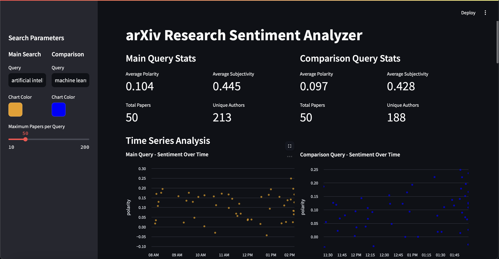
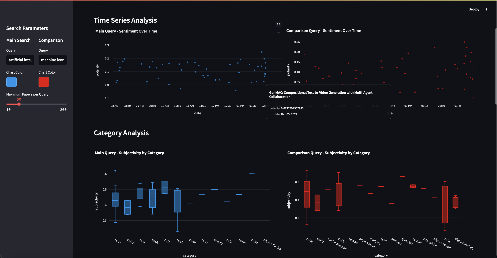
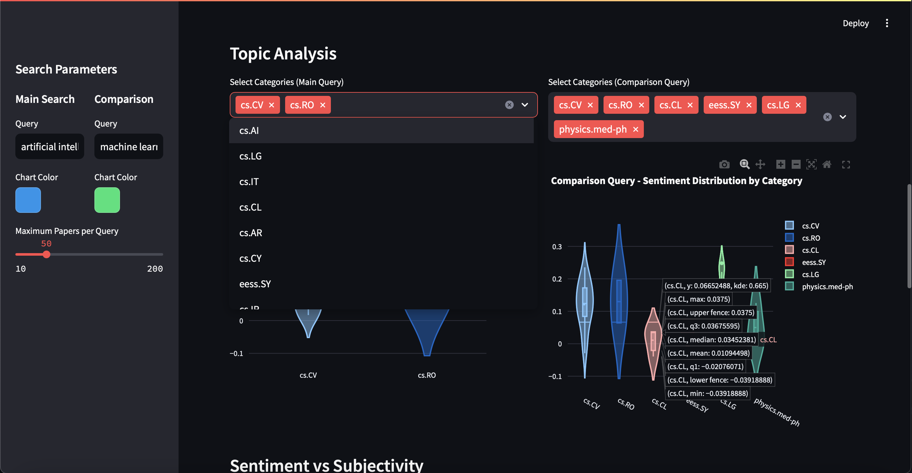
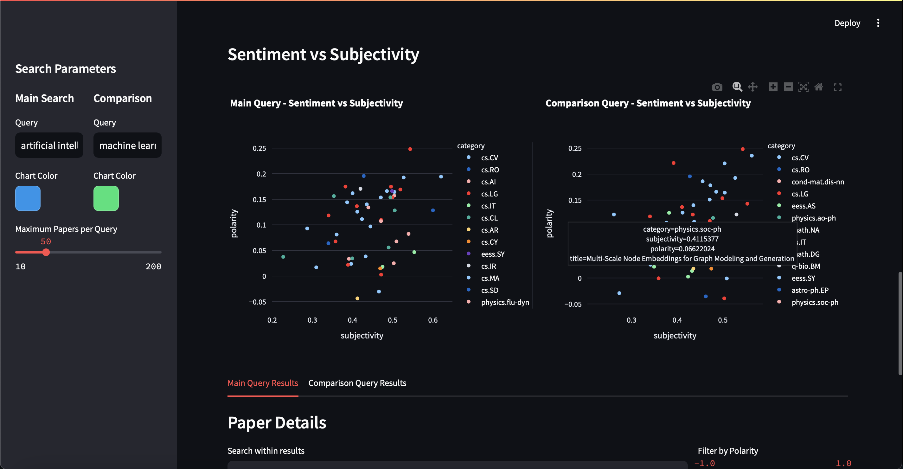
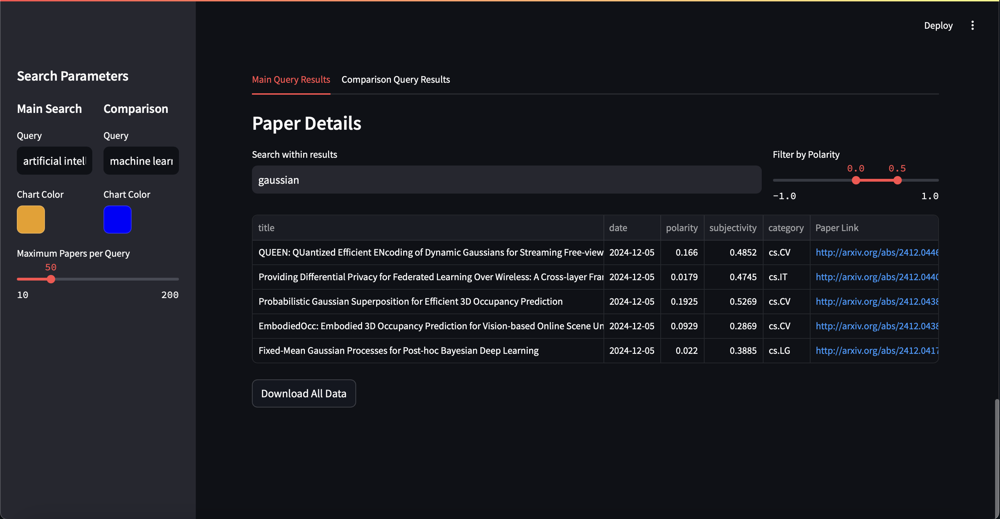

Welcome to arXiv Research Sentiment Analyzer! Check it out [here](https://arxiv-sentiment-analysis.streamlit.app).

Choose any two topics, from artificial intelligence and machine learning to electrons and latin squares. Choose the chart color you prefer and how many papers should be scraped for the queries.  

Analyze the polarity of these papers over time and an anaysis of the relevant categories, which depends on the subject of the query. Hover over a dot to see information such as the paper name, date, and polarity, and hover over the categories to view information on the box plot.

Choose two or more topics from each query to compare in greater depth.

Analyze the relationship between subjectivity and polarity and analyze the overall trend in those categories.

View the details of each paper in either query, and even check out the paper with the provided link or download the data if you are interested.

